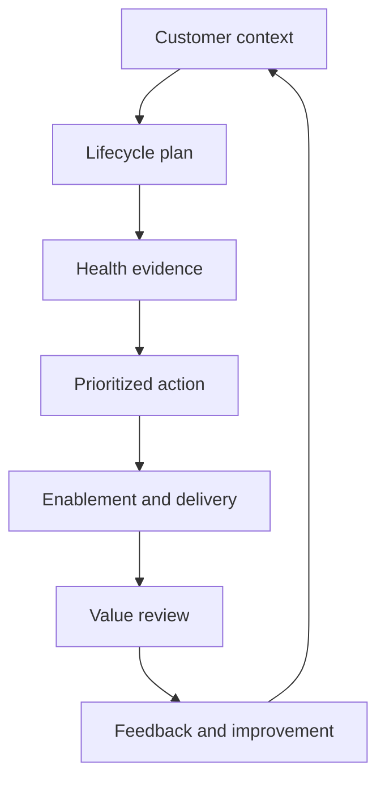

# Customer Lifecycle Management Framework

A practical system for keeping customer context, risk, enablement, value, and follow-through visible as a customer portfolio grows.

Customer relationships become fragile when important context stays inside individual conversations, account status is based on instinct, and feedback disappears after it is recorded. This framework is designed to prevent that. It connects what the customer is trying to achieve with the evidence a team needs to decide what should happen next.

## The operating rules

1. **No status without evidence.** A label such as *healthy* or *at risk* must be supported by an observable signal.
2. **No risk without consequence.** A problem becomes a priority when its effect on the customer's operation is understood.
3. **No action without an owner.** Every important next step needs one accountable person and a clear follow-up point.
4. **No closure without confirmation.** Internal completion is not enough; the customer outcome must be checked.

## How the system works

The sequence is deliberately circular. Customer conditions change, so context must be refreshed after important outcomes, risks, or stakeholder changes.

## Repository guide

| Area | The decision it supports |
| --- | --- |
| [Customer context](framework/01-customer-context.md) | What is the customer actually trying to achieve, and what makes it difficult? |
| [Health and prioritization](framework/02-health-and-prioritization.md) | Which accounts need attention now, and what evidence supports that decision? |
| [Adoption and enablement](framework/03-adoption-and-enablement.md) | What must a customer be able to do differently after training? |
| [Voice of Customer](framework/04-voice-of-customer.md) | Is the issue rooted in product, service, process, or understanding—and who owns the next step? |
| [Value and retention](framework/05-value-and-retention.md) | What evidence connects activity to a business outcome? |
| [Early Risk Response Procedure](procedures/early-risk-response.md) | How should an emerging customer risk be verified, owned, communicated, and closed? |
| [Account Review Template](templates/account-review-template.md) | What should be captured before an account decision? |
| [Customer Feedback Record](templates/customer-feedback-record.md) | What information makes feedback useful to another team? |
| [Value Review Template](templates/value-review-template.md) | How should progress, evidence, and the next decision be presented? |

## A scaled portfolio is not an equal-time portfolio

Giving every account the same amount of attention can feel fair, but it ignores consequence. A scaled portfolio needs consistent decision logic: review reliable signals, identify where delay changes the outcome, and focus human judgment there. Stable customers still receive a dependable rhythm; emerging risks receive earlier attention.

## AI use and accountability

AI can help compare account histories, group repeated issues, summarize long notes, challenge an initial interpretation, and improve the clarity of a draft. It should not make the final account judgment or create a customer commitment on its own.

Before acting on AI-assisted work, I check the source record, look for missing context or contradictions, remove sensitive information, and decide whether the recommendation is supported. The responsibility for the decision remains human.

## Practical context

The thinking documented here comes from work across customer relationships, enterprise operations, training, digital delivery, and cross-functional product improvement. Examples are generalized from recurring situations and contain no confidential client data. This is an adaptable working framework, not an official procedure for any current or former employer.

## Author

**Shaibal Barman**  
[LinkedIn](https://linkedin.com/in/shaibal-barman) · [Portfolio](https://shaibal-portfolio.brmnshaibal.workers.dev/)
